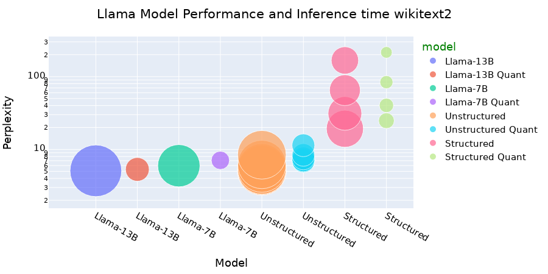
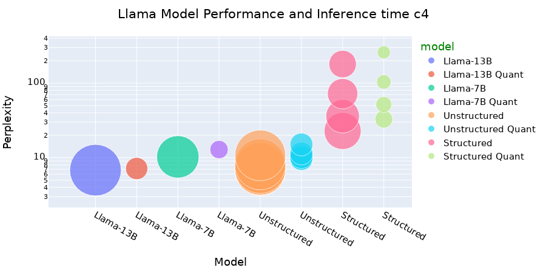

# Compressing Large Language Models With Pruning, Distillation, and Quantization

# Intro 
LLMs (Large Language Models) have captured a lot of attention due to their ability to perform a multitude of tasks with accuracy and precision. They have shown to be able to adapt well to new tasks and to produce output to the user that resembles that of a human (i.e. exhibit human level reasoning). However, in order to achieve that level of accuracy LLMs usually have parameters that number in the billions and are trained on huge datasets. This means that the memory requirements and the computational complexity for inference are prohibitve for the deployment of the model on smaller devices with less compute and in the case where their memory requirements are reduced the task of fine tuining or knowledge distillation becomes exceedingly hard and requires specialized datasets. A substantial amount of funding is given for the research of efficient and performant pruning, tuning and knowledge distillation in order to make the deployment of LLMs on less computationally capable hardware possible.

# Description
In this project we are examining the effect of structured and unstructured pruning on Llama 2 7B and Llama 2 13B by evaluating the accuracy of the model using the perplexity metric using the wikitext2, cb4 and ptb evaluation benchmarks. We also examine the effect of quantization on inference time. We run experiments to see the effect of channel level and block level pruning and the accuracy they maintain. We visualize the results and provide a demo on a sample question to verify the capabilities of the pruned and tuned models.

# Set Up the Environment
```dotnetcli
module purge
module load cudnn/8.6.0.163-cuda11
module load cuda/11.3.1

srun --cpus-per-task=1 --time=0:30:00 --mem=24000 --gres=gpu:1 --pty /bin/bash

#to compile bitsandbytes
singularity exec --nv --overlay /home/xc1490/home/apps/llm2/overlay-15GB-500K.ext3:rw /scratch/work/public/singularity/cuda11.0-cudnn8-devel-ubuntu18.04.sif /bin/bash
source /ext3/env.sh

export BNB_CUDA_VERSION=113
export LD_LIBRARY_PATH=$LD_LIBRARY_PATH:/share/apps/cuda/11.3.1/lib64

cd /home/xc1490/home/projects/hpml/project/bitsandbytes
CUDA_VERSION=113 make cuda11x
python setup.py install
#check if bitsandbytes is installed
python -m bitsandbytes
```

Make sure to export `BNB_CUDA_VERSION` and `LD_LIBRARY_PATH` if you use a different CUDA version.

# Scripts
- Unstructured Pruning: [sparsegpt](sparsegpt)
- Structured Pruning: [LLM-pruner](LLM-pruner)
- Quantization: [bitsandbytes](bitsandbytes)

To run jobs, go to [jobs](jobs)

# How to Run
- LLM Pruner   
  - LLM Pruner was installed following the instructions from the originial repository which is also given here. Follow those instructions and then find in the script folder the script used to run the jobs. The script has been modified to be more of a sample and requires modification based on the type of environment you are running it in. In our case we run LLM Pruner on the NYU HPC Greene Cluster using singularity containers. The job had allocated 20 CPUs, 200 GB of memory and 1 V100 GPU.
  -  The script for the job requires you to specify the prune and tune directory to save the pruned/tuned model. The original script found in the LLM Pruner repo did no specify a folder inside prune_log/llama_prune and therefore every time you run the job it replaced the output model (in pytorch_model.bin). In order to circumvent that I included a folder in the llama_prune folder which indicates the pruning ratio and the level of pruning being done. This made it easier to run both the evaluation and test speedup tests for multiple pruned models at once. 
  - As you will find out the model can be pruned on multiple levels, channel, layer or block. You should be careful when specifying between them because the ratio may not directly correlate to the retained parameter ratio for the block or layer levels like it does for the channel level.
  -  The job script also contains the speedup test for the pretrained model, in our case Llama 2 7B, as well as the speedup test for the pruned model. If you don't need the speedup test for the pretrained model you can remove the test or if you want to run the speedup after in a separate job you can move that to a separate script.
  -  To generate an output we create a notebook file that uses only the required functions and initiates a prompt using interactive python widgets for the user to enter an input and then provides the models output. Initially the script required the installation and use of gradio but we removed that due to the extra dependencies needed. We found it was easier to use ipywidgets.


# Results:
You can see [notebooks/results.ipynb](notebooks/results.ipynb) for all results and figure generation.  
Due to the size of both the pretrained and the pruned models it was not practical to include the files here.  
Feel free to run the scripts and replicate the results yourselves.  

The results show that channel level pruning performs worse than block level pruning because it does not retain as much of the internal structure of the LLM and breaks some of the important connections between layers. We also see evidence that a retained parameter ratio of less than 80% makes the LLM almost unusable. It is still yet to be verified if a different dataset than the Alpaca is able to bring the accuracy back up to a performant level. We see a huge reduction in the parameters and a decrese in inference time after quantization which greatly enhances the deployability of the model especially for the Llama 2 7B model.


# Objectives, Solution Approach, Value of Solution 

Objectives:
- To apply structured pruning to LLMs, thereby reducing the number of active weights and connections, based on the principles of Unstructured and Structured Pruning (SparseGPT and LLM-Pruner).
- To implement quantization techniques that convert floating-point representations to lower bit representations, drawing from the 4-bit NormalFloat (NF4) quantization and Double Quantization (DQ) methods discussed in QLORA.
- To explore the combined application of pruning, distillation, and quantization to balance the trade-offs between inference speed, memory usage, and model accuracy.
- To maintain the task-agnostic capabilities of LLMs post-compression, ensuring that they continue to function as versatile task solvers.
  
Solution Approach:  
- We used LLM-Pruner to perform structured pruning on 4 different pruning ratios for 2 different levels, block and channel and we used SparseGPT to perform unstructured pruning with 9 different ratios.
- We run unstructured pruning twice to find the effect on the perplexity and accuracy and compare with the same pruning ratio applied once.
- We run pruning and then quantization to see the effect on the accuracy and perplexity and we evaluated the inference performance.
- We recorded a demo to show the capabilities of the structured models compared to the pretrained model.
  
Value of Solution:  
- We examine the usability of pruned and quantized models and the effectiveness of different types of pruning and quantization techniques and how these allow for different types of applications like embedded devices.


# Solution Approach 
- Pruning
  - Structured Pruning
  - Unstructured Pruning
- Distillation
  - Post Pruning Distillation after structured Pruning
- Quantization
  - 4 bit NormalFloat quantization


# Results






.png)
.png)](https://github.com/panaschristou/LLM_Compression/blob/main/results/performance_infer_compute_line_wikitext2_GPU%20Memory%20Requirements%20(MiB).png) 
.png)](https://github.com/panaschristou/LLM_Compression/blob/main/results/performance_infer_compute_line_wikitext2_Computational%20Complexity%20(GMac).png) 
